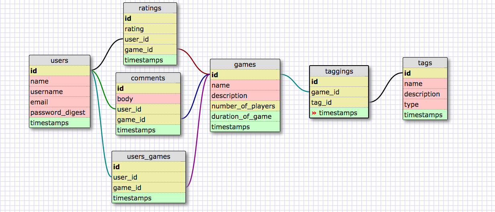

Social-Gaming
Team name and team members:
Ninja Turtles! (The Young-Adult-Ninja-Dev Turtles)
Josh
Deez
Alex
Chris

A brief description of your MVP: 
A social network that allows users to inventory their board game, and discuss/rate them.

A link to your team Trello board:
https://trello.com/b/dr5oZQT4/social-gaming-project

A link to your wireframes:
https://precursorapp.com/document/17592197753619#

A brief description of your team dynamic and git workflow: 

